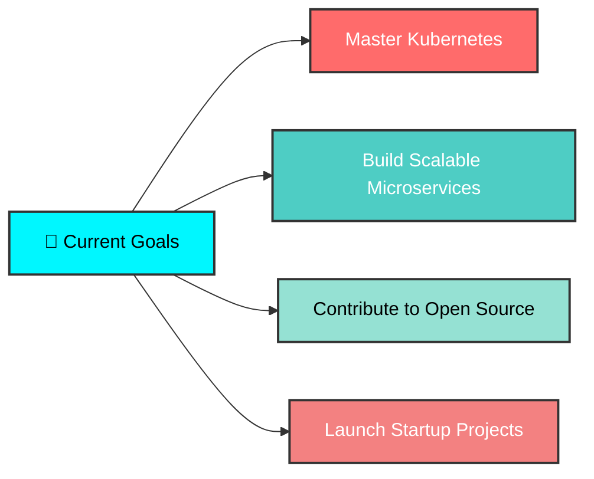

<!-- Header with a banner --->
<!--

  

-->

#  Hi, I'm Azraf Sami

### 🚀 Passionate Developer & Learner from Bangladesh 🇧🇩

<!-- Profile Views -->

  

<!-- GitHub Trophy -->

  

<table>
  <tr>
    <td>
      <h2>🚀 About Me</h2>
      <ul>
        <li>🔭 I'm currently working on <strong>PERN Stack Projects</strong></li>
        <li>🌱 I'm currently learning <strong>Advanced DevOps</strong></li>
        <li>🤝 I'm looking for collaborations on <strong>Startup Projects</strong></li>
        <li>💬 Ask me about <strong>React, JavaScript, Java, Bash Scripting, FastAPI, REST API, Microservice Architecture, RabbitMQ, Kubernetes, Ansible, MCP</strong></li>
        <li>⚡ Fun fact: <strong>I love watching documentaries about International Politics!</strong></li>
      </ul>
    </td>
    <td>
      
    </td>
  </tr>
</table>

## 🛠️ Tech Arsenal  

### 💻 Languages

  
  
  
  
  
  
  
  

### 🎨 Frontend 

  
  
  
  
  
  

### ⚙️ Backend & API 

  
  
  
  

### 🗄️ Databases  

  
  
  
  
  

### 🔄 Microservices & Message Queues  

  
  
  

### 🚀 DevOps & Infrastructure  

  
  
  
  
  

### ⛓️ Blockchain  

  
  

### 🛠️ Tools & OS  

  
  

## 💼 Current Focus

```mermaid
graph LR
    A[🎯 Current Goals] --> B[Master Kubernetes]
    A --> C[Build Scalable Microservices]
    A --> D[Contribute to Open Source]
    A --> E[Launch Startup Projects]
    
    style A fill:#00F7FF,stroke:#333,stroke-width:2px,color:#000
    style B fill:#FF6B6B,stroke:#333,stroke-width:2px,color:#fff
    style C fill:#4ECDC4,stroke:#333,stroke-width:2px,color:#fff
    style D fill:#95E1D3,stroke:#333,stroke-width:2px,color:#000
    style E fill:#F38181,stroke:#333,stroke-width:2px,color:#fff
```

## 📊 GitHub Stats  

  

 
 

  

  

<!---->
<!--https://github.com/abozanona/pacman-contribution-graph-->

## 💭 Random Dev Quote

  
### 💙 Show some love by starring ⭐ some repositories!

**"Talk is cheap. Show me the code."** - Linus Torvalds

### 🤝 Let's Connect and Build Something Amazing Together!

